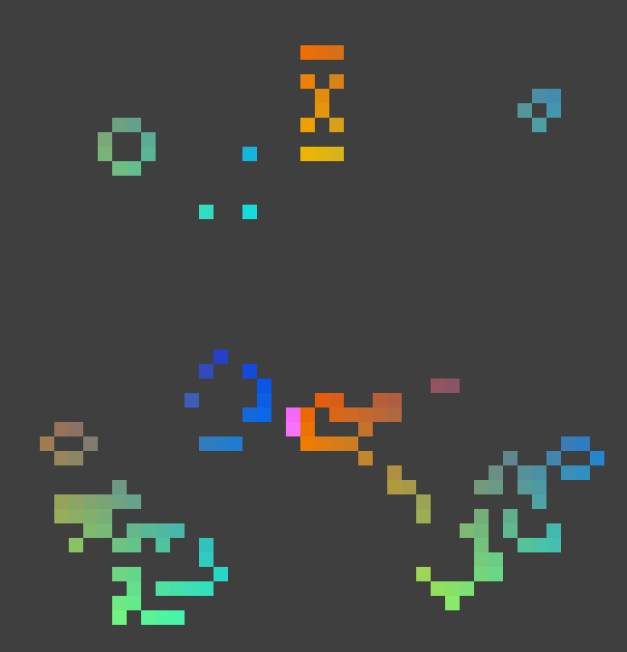
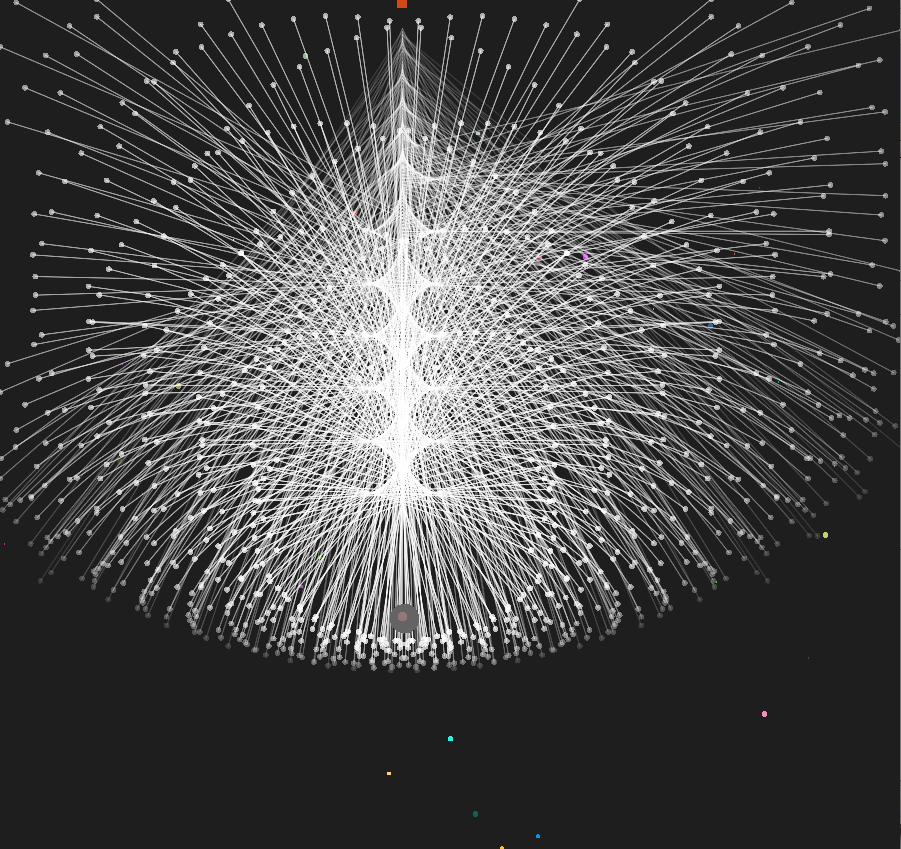
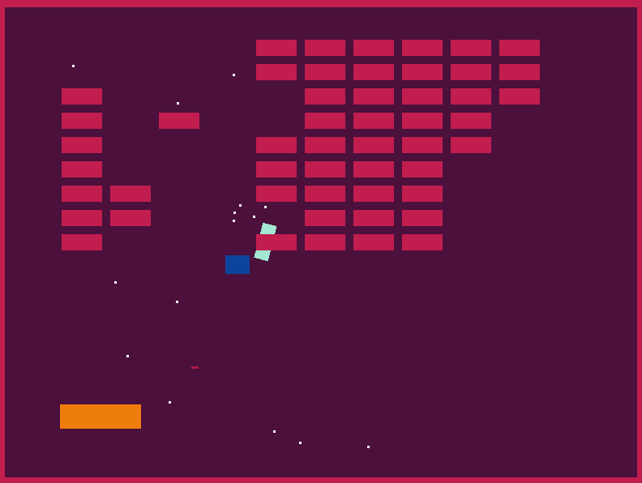
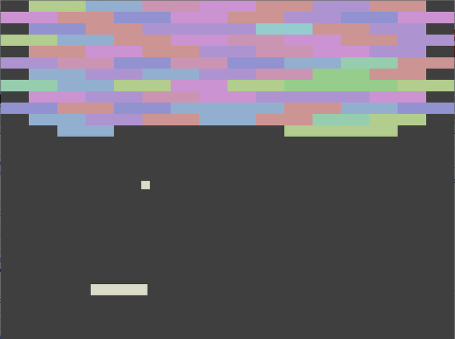
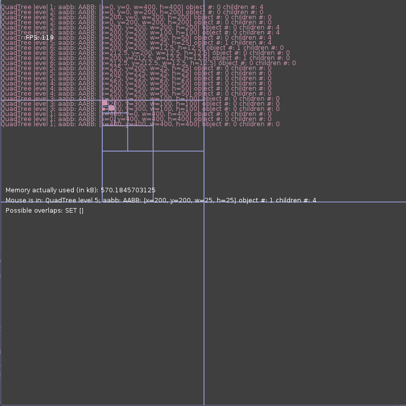
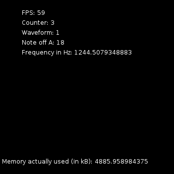
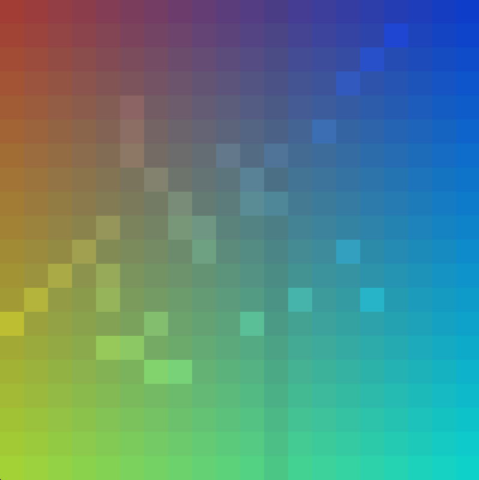
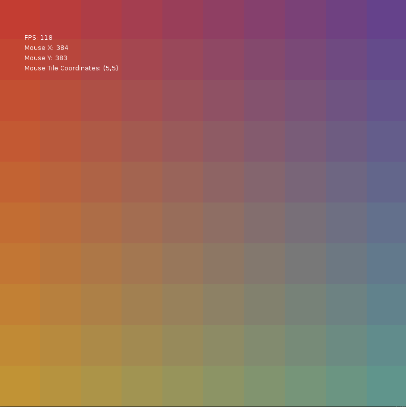
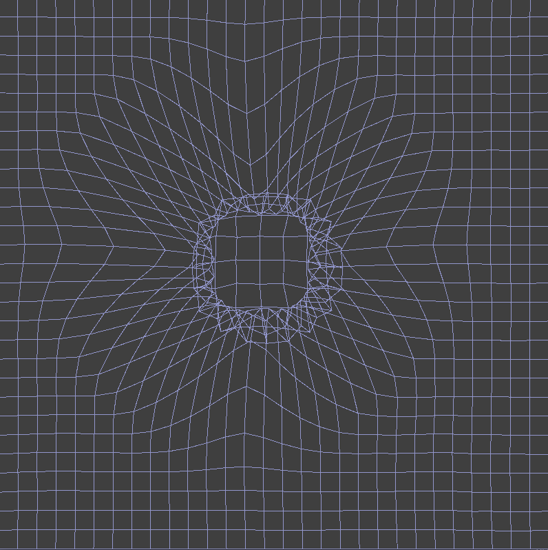
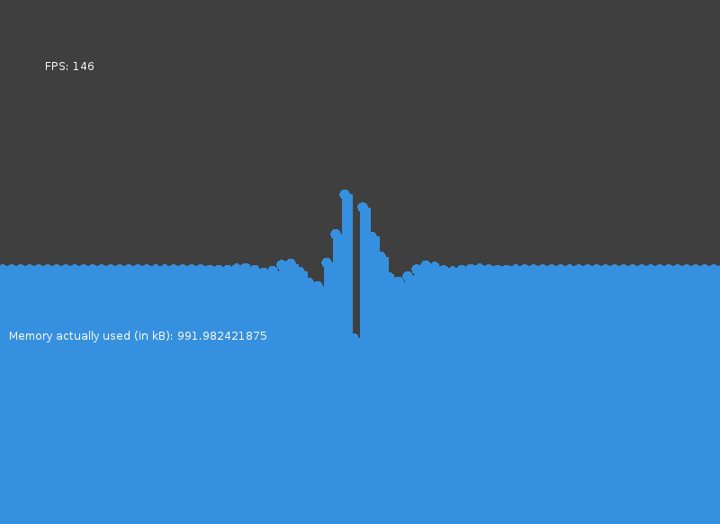

love-lonelyatoms
=============

Overview
--------

A package that includes game engine code that I have written for the Love2d framework.

A few highlights:

* A lua-based entity-component system, and a number of common components
* Basic AI steering behavior
* Real-time audio synthesis
* Simple scene-system

The "game" packages I have created, mainly to test and play around with the engine, are detailed below.

Requirements: [Love2d](https://www.love2d.org/)

The warpinggrid project runs very slow without the version of Love compiled with Luajit. The easiest way to get that is probably to search the forums for the latest 0.8.0 build.

### Package Structure

Directories:

* Games: Directory holding game projects
* Scraps: Possibly working, probably obsolete and not-working games.
* Shared: Game engine code shared across games

### To Build and run a game

Directories are organized to make it easier to have multiple game projects. To create a new game, add a new directory to the "games" folder. To build, run:

	./build.sh {gamename}

ex:

	./build.sh juicy

This script will build a .love package, put it into a "distro" directory, and automatically run the .love package.

Games
-----

### Automata

Minimalist "Game of Life" implementation with some pretty colors.

### Bullettest

Test game for shotting bullets, placing them in a quadtree, and testing an (invincible) opponent with AI steering behaviors.

### Juicy

An implementation of some of Martin Jonasson &amp; Petri Purho's "[Juice It Or Lose It](http://www.youtube.com/watch?v=Fy0aCDmgnxg)" features in Love2d. Somewhat updated version of what I wrote up [here](http://jimfingal.com/wp/juicy-breakout-in-love/).

### EchoBreakout

A port of "[Echo Breakout](http://sodesne.com/blog/2012/11/11/echobreakout)", a music hack day project by Brian Fife and I did one year.

### Quadtreetest

Code to visually test my implementation of quadtrees

### Soundtest

Test implementation of real-time audio synthesis. Press up or down to change wave types, and press "w" or "s" to change note.

### Soundtiles

An audio toy that uses real-time audio synthesis and a looping window to create and play simple set of notes/chords. Click on a square to set a note. Press up or down to change wave types.

### Tile Test

Test implementation of mapping the screen into tiles

### Warpinggrid

A 3d warping grid projected onto a 2d plane, a la Geometry Wars.

Press enter or space to warp the grid. 

Concepts drawn from http://gamedev.tutsplus.com/tutorials/implementation/make-a-neon-vector-shooter-in-xna-the-warping-grid/ and ported to lua.

### Water

Moderately dissatisfactory experiment in using springs to simulate water effects. Based on http://gamedev.tutsplus.com/tutorials/implementation/make-a-splash-with-2d-water-effects/

Shared Libraries
----------------

I'll fill this out with more details on the code here at some point.

Directories:

### Audio

Real-time Audio Synthesis in lua. 

Implementation drawn from:

http://www.headchant.com/2011/09/20/sound-synthesis-with-love/

http://gamedev.tutsplus.com/tutorials/implementation/noise-creating-a-synthesizer-for-retro-sound-effects-core-engine/

### Collections

Port of some java-style collections

### Entity

 Basic Entity-Component framework inspired by Artemis and posts by Adam Martin. Just about everything in the game is an Entity; every data attribute is packaged in a Component; and everything that happens to update or react to those Components happens in a System. For an overview of the theory behind this, check out this post

### External

External Libraries: 

* [Middleclass](https://github.com/kikito/middleclass) by Kikito
* Lua implementation of [Robert Penner's Easing Functions](https://github.com/EmmanuelOga/easing/blob/master/lib/easing.lua)
* [SLAM](https://github.com/vrld/slam) and port of [HUMP](https://github.com/vrld/hump) Vector class by Matthias Richter
* [UUID implementation](https://github.com/Tieske/uuid/blob/master/src/uuid.lua) by Thijs Schreijer

### Game

Some generic game code. Directories:

* AI: Steering behavior ai
* Automata: Cellular automata
* Generic: Generic behaviors
* Warpinggrid: 3D warping groud source

